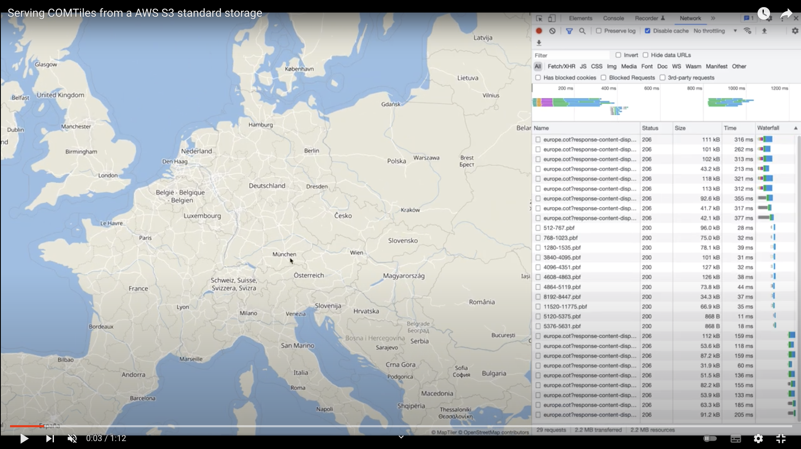
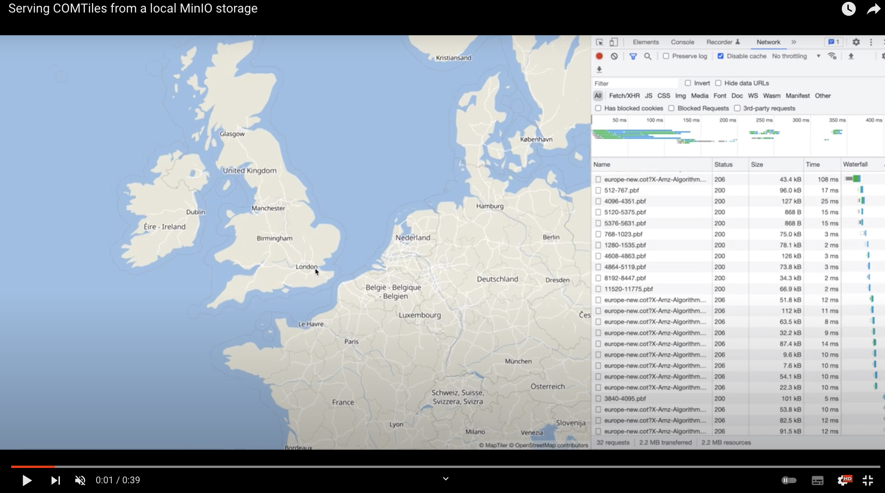
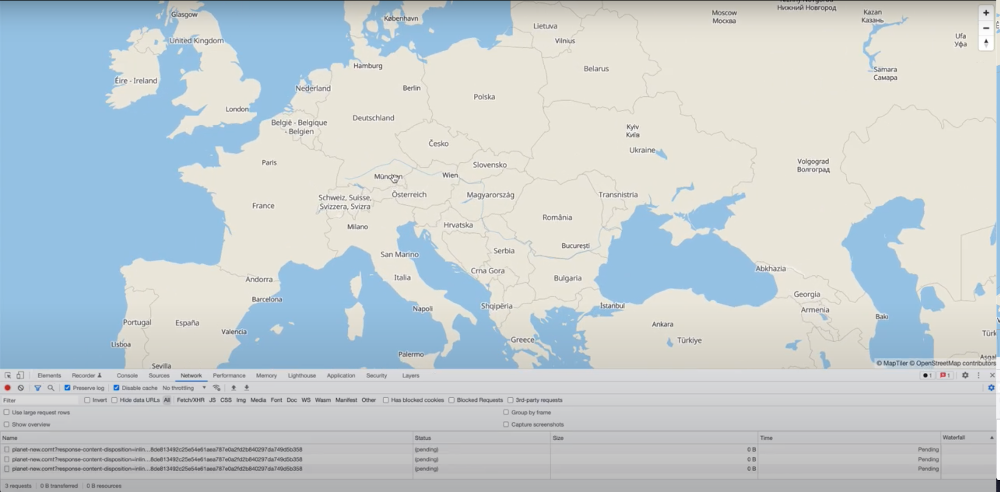

# Cloud Optimized Map Tiles (COMTiles)
Based on the ideas of [Cloud Optimized GeoTIFF](https://www.cogeo.org/) and extended for the usage of raster and in particular vector map tilesets.
COMTiles are a streamable and read optimized file archive for hosting map tiles at global scale on a cloud object storage.
Currently most geospatial data formats (like MBTiles, Shapefiles, KML, ...) were developed only with the POSIX filesystem access in mind.
COMTiles in contrast is designed to be hosted on a cloud object storage like AWS S3 or Azure Blob Storage without the need for a database or server on the backend side.
The map tiles can be accessed directly from a browser via HTTP GET range requests. Via COMTiles an object storage can be used as a spatial database regarding the visualization of map tiles.
COMTiles aims to be a MBTiles database for the cloud.

The main focus of COMTiles is to significantly reduce costs and simplify the hosting of large raster and vector tilesets at global scale
in the cloud because no backend (database, server) is needed. 
In addition the individual tile requests can also be batched to improve performance and in particular to reduce the storage costs because
every HTTP range request on a cloud object storage has to be paid.
This can reduce the number of tile requests by up to 90%. 
On a 4K display with a vector tileset for example this can result in a reduction from 45 requests with the standard approach (tile by tile) to 5 requests with the tile batch approach.

For the basic concepts of COMTiles have a look at the lightning talk at the [OGC Cloud-Native Geospatial Outreach Event](https://youtu.be/2_q5NsgxyVE?t=24096). 
For a detailed description of the format have a look at the [specification](packages/spec).

## Tools
- [@com-tiles/mbtiles-converter](packages/mbtiles-converter): To convert a MBTiles database to a COMTiles archive the `@com-tiles/mbtiles-converter` command line tool can be used.
- [@com-tiles/maplibre-provider](packages/maplibre-provider): For displaying a COMTiles archive hosted on an object storage directly in the browser based on the MapLibre map framework the `@com-tiles/maplibre-provider`package can be used.
- [@com-tiles/provider](packages/provider): For the integration in other web mapping libraries like OpenLayer or Leaflet the `@com-tiles/provider` package can be used.

## Demo
In the following examples the europe tileset is based on a MBTiles database from [MapTiler](https://www.maptiler.com/data/) and converted to
a COMTiles archive with the `@comt/mbtiles-converter`.
The index for zoom level 0 to 10 is part of the initial fetch when the page is loaded.
For zoom 11 to 14 the index fragments with a size of 37kb are lazy loaded.
For exploring a city like munich and surroundings only one additional HTTP request per zoom level is needed.

Europe tileset hosted on a `AWS S3` standard storage with a disabled browser cache.

Europe tileset hosted on a `local MinIO` storage with a disabled browser cache.

In the following example the tile requests are `batched` resulting in only 2 to 3 tile requests for a specific zoom level
compared to up to 15 requests with the standard approach (tile by tile) on an HD display.

In the following example a planet scale tileset is hosted on an `AWS S3` and accessed from an `AWS CloudFront` CDN.    
The index for zoom 0 to 7 is downloaded with the first initial fetch.    
For zoom 8 to 14 one pre-fetch per zoom level for the specific index fragment is needed, but this only takes about 30 milliseconds.  

## COMTiles archive vs directly hosting the map tiles
**Advantages of COMTiles**
- Loading up over 350 million tiles to a cloud storage for a planet scale vector tiles dataset is significantly more expensive because every tile
  upload has to be paid separately
- Uploading a single large file is noticeably faster compared to uploading millions of individual files
- A archive format which combines the metadata and data into one file is more easy to handle
- Saves storage because a (raster) tileset at global scale can have many repeated tiles (about 70 percent of the earth is water)
- Tile requests can be batched to significantly reduce the number of requests by up to 90% 

**Advantages of directly hosting the map tiles**   
- For a tileset at global scale from zoom level 8 on at least one prefetch for a index fragment is needed for every zoom level up to 14 -> this is bearly or not at all noticeable for the user regarding the user experience and workflow

## Similar formats
### Cloud Optimized GeoTiff
A [Cloud Optimized GeoTIFF (COG) ](https://www.cogeo.org/) is a regular GeoTIFF file with an internal organization that let clients ask for just the portions of a file that they need
via HTTP GET range requests. A COG is limited to raster data.

### FlatGeobuf
A performant binary encoding for geographic data based on flatbuffers that can hold a collection of Simple Features including circular interpolations as defined by SQL-MM Part 3.

### PMTiles
[PMTiles](https://github.com/protomaps/PMTiles) is a single-file archive format for directories of map tiles.
The index of a PMTiles archive is structured in directories compared to the fragment based approach of a COMTiles archive.

## Use Cases
- Displaying map tiles directly in the browser via a web mapping framework like MapLibreGL JS
- Downloading map extracts for the offline usage in apps
- Downloading map extracts for the hosting on a dedicated on-premise infrastructure

## Repository structure
- [@com-tiles/spec](packages/spec): COMTiles file format specification
- [@com-tiles/provider](packages/provider): Utility functions for working with COMTiles
- [@com-tiles/maplibre-provider](packages/maplibre-provider): COMTiles provider for MapLibre GL JS
- [@com-tiles/server](packages/server): MapServer for serving tiles, can be hosted in a cloud native (serverless) environment
- [@com-tiles/mbtiles-converter](packages/mbtiles-converter): Converting map tiles stored in a MBTiles database to a COMTiles archive

## References
- https://medium.com/planet-stories/cloud-native-geospatial-part-2-the-cloud-optimized-geotiff-6b3f15c696ed
- https://towardsdatascience.com/turn-amazon-s3-into-a-spatio-temporal-database-40f1a210e943
- https://github.com/flatgeobuf/flatgeobuf
- https://medium.com/@mojodna/tapalcatl-cloud-optimized-tile-archives-1db8d4577d92
- https://docs.tiledb.com/main/basic-concepts/terminology
- https://github.com/protomaps/PMTiles

  