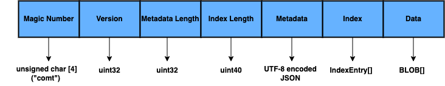
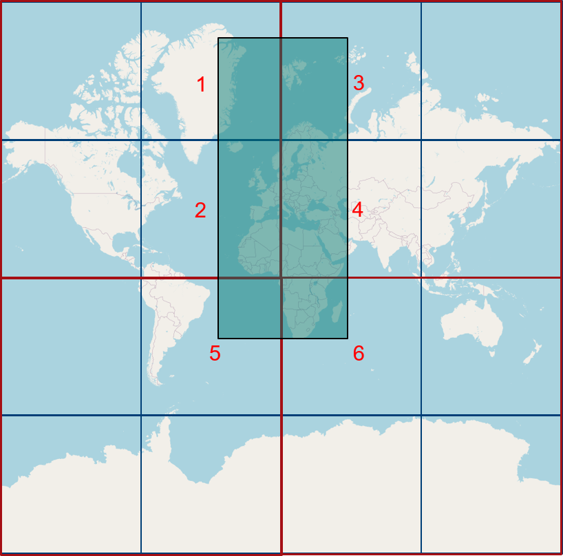

# Cloud Optimized Map Tiles (COMT)
COMTiles are a streamable and read optimized file archive for storing raster and
in particular vector tilesets at global scale in a cloud object storage and accessing 
the tiles or tile batches via http range requests.  

## Concept
A COMTiles archive mainly consists of a metdata, index and data section.  
A COMTiles file archive has the following layout:  

### Metadata
The metadata section describes the properties, structure and content of the tileset encoded in a [JSON document](packages/spec/metadata-schema).
The definiton of the structure and boundaries of a tileset are based on the `OGC Two Dimensional Tile Matrix Set` specification.
All `TileMatrixSets` listed in the [Common TileMatrixSet definitions](http://docs.opengeospatial.org/is/17-083r2/17-083r2.html#61) are supported with `Web Mercator Quad` as the default.
A subset of the tileset can be defined based on the `tile matrix set limits` data structure.

### Data
The data section contains the actual vector or raster tiles.
The encoding of the map tiles (pbf, jpg, png, webp) is specified with the `tileFormat` property of the metadata document.
The offset wihtin the data section for and the size of a specific tile is defined in the `index`.
Based on the information of the index the tiles can be request with HTTP GET range requests.
To improve the latency the single tile requests for a specific viewport of a map can be batched.
To minimize the number of batched tile requests the tiles in the data section should be ordered on a space-filling curve.
The ordering of the tiles can be specified with the `tileOrdering` property (Hilbert, Z-Order, Row-Major) of the metadata document.

### Index
The basic concept of a COMTiles archive is to create an additional `index` which stores the references (offset and size) to the actual map tiles located in the data section via so called `index entries (records)`.
For a planet wide vector tileset this index has about 3 gb in size (will be optimized in v2 to about 1.3 gb).
Because of the resulting size for large tilesets the index has to be streamable which means that only parts of the index can be requested to allow a fluent user experience already known from maps like Google Maps or OpenStreetMap.
One main design goal of COMTiles is to minimize the number of HTTP GET range requests for the download of parts of the index for performance and cost reasons.
With ordering the index on space-filling curves (Hilbert, Z-Order, Row-Major), packing pyramids into directories and aggregating the index in fragments three different approaches has been evaluated.
Tests showed that subdividing the index peer zoom level in so called ``index fragments`` with a variable number of ``index entries`` referencing
the specific map tiles seems to be the most effective approach in terms of the number of http range requests for viusalizing map tiles at global scale.
Based on the concept of index fragments most of the time only one additional pre-fetch per zoom level is needed before accessing the map tiles for the current viewport of the map.
The fragments can be cached on client side which omits the prefetch step for accessing the same viewport again.
Depending on the boundaries of the tileset the index fragments can be sparse or dense.
Based on the `tile matrix set limits` structure defined in the metdata document the number of index entries in a sparse fragment can be calculated.
In addition parts of the index can also be unfragmented which means the index entries are not aggregated into fragments.
The unfragmented part of the index must be downloaded with the first initial fetch when the page loads.
For a planet wide tileset this should be zoom level 0 to 7.

## Specification

### Layout

Little endian encoding is used.  
A COMTiles file archive has the following layout:   
    
**Magic**  
4-byte ANSI string ("comt") 

**Version**    
The version of the COMTiles archive. It is currently 1.

**Metadata Length**  
Length of the metadata document encoded as unit32 in little-endian order.

**Index Length**    
Length of the index encoded as uint40 in little-endian order.

**Metadata**  
UTF-8 encoded JSON document which describes how to access the tileset, see [JSON Schema definition](metadata-schema/metadata.json).

**Index**    
The index consists of a array of index entries (records).  
A single index entry consists of a offset (default 5 bytes) and the size of the map tile (default 4 bytes)
in the data section. Offset and size are encoded as unsigned integers in the little-endian order.
With the defaults a map tile can have a maximum size of 4 GB and an offset of 1 TB.
The number of bytes for the offset can be defined via the `tileOffsetBytes` property in the metadata document.
For a planet scale vector tileset (zoom 0-14) the index is about 3 GB in size, which is to large to download the index as a whole.
To make the index streamable, so that only parts of the index can be fetched, the index is divided into `index fragments`.
The number of index entries per fragment is defined via the `aggregationCoefficient` property in the metadata document.
For quadtree based TileMatrixCRS like WebMercatorQuad it's recommended
to be power of 4 (NumberOfIndexRecordsPerFragment=4^aggregationCoefficient).
The aggregationCoefficient is defined for every zoom level and has a default value of 6 which means 4096 index entries are aggregated.
The boundaries of a tileset are defined via the `TileMatrixSet` data structure in the metadata document.
Depending on the tileset boundaries a index fragment can be a sparse or dense fragment.
Based on the `tile matrix set limits` structure defined in the metdata document the number of index entries in a sparse fragment can be calculated.
The order of how the index fragments are arranged can be defined with the `fragmentOrdering` property.
The order of how the index entries within an index fragment are arranged can be defined with the `tileOrdering` property.
Tests showed that index entries and fragments arranged in the `RowMajor` order (default) produces the best results.
In addition the index entries can also be ordered via the space filling curves `Z-order` and `Hilbert`.

**Data**  
The data section contains the actual vector or raster tile blobs.
The encoding is specified with the `tileFormat` property in the metadata document.
The used order of the map tiles can be specified via the `tileOrdering` property in the metadata document.
Besides the default value `RowMajor` there can be also the space filling curves `ZOrder` and `Hilbert`.

## Concepts

### TileMatrix
Inspired by 'OGC Two Dimensional Tile Matrix Set' OGC specification (draft).
- TileSet
- TileMatrix
- TileMatrixLimits

### Index Fragments

### Index Aggregation
Example for the index aggregation of sparse fragments:
- TileMatrixCRS: WebMercatorQuad
- Extracted Area: Europe and Africa
- Index fragment order: Row-Major

### Loading the index

### Improvements for v2
- Only one absolute offset per fragment is stored and every index entry holds only the tile size.
  The client is responsible for resolving the absolute offset for the index entries of a fragment.
  This can reduce the index size for a planet vector tileset from 3gb to about 1.3gb.
- Compress the index and add a additional index table to the archive which references the variable sized index fragments.
  The full index table can be fetched within the initial request.

## Glossary
- MapTile
- TileSet
- TileMatrixSet
- TileMatrix
- TileMatrixLimits
- Index
- IndexFragment
- IndexEntry
- AggregationCoefficient: Specifies the Number of index entries aggregated in one index fragment. 
  For quadtree based TileMatrixCRS like WebMercatorQuad it's recommended
  to be power of 4.
  
