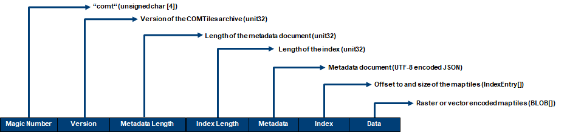
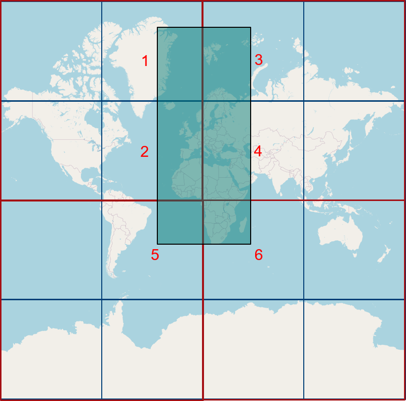

# Cloud Optimized Map Tiles (COMT)
COMTiles are a streamable, read optimized, single-file archive for storing large-scale raster or vector tilesets in an cloud object storage and accessing 
the tiles or tile batches via http range requests.  

## Specification

### Layout
Little endian encoding is used.  

- Magic  
  - 4-byte ANSI string -> "comt"  
- Version  
  - The version of the COMTiles archive. It is currently 1.
- Metadata Length
  - Length of the metadata document (unit32)
- Index Length  
  - Length of the index (uint32)  
- Metadata
    - UTF-8 encoded JSON document which describes how to access the tileset
    - [JSON Schema definition](metadata-schema/metadata.json)
- Index  
  - The index is also streamable which means that only parts of the index can be requested
  - This is important because at planet scale the index can have size about 2.7 GB
  - The index consists of a array of index entries and is clustered per zoom in cluster cells
  - A index entry consists of a TileOffset (default 4 bytes) and TileSize (default 4 bytes)
  - The size of the cluster cells is defined via the coalescence coefficient in the metadata document
  - Layout IndexRecord
    - Offset -> size specified in the metadata document -> defaults to uint32
    - TileSize -> unit32
- Data
  - Raster or vector tile Blobs
  - The content is specified in the Metadata ``tileFormat`` property
  - The Data are ordered in a space filling curve as specified in the metatdata ``dataOrdering`` property. By ordering the data in a space filling curve. the get requests can be batched to minimize http rang request in addition to minimize cache misses and page fault on the OS side in the cloud
  - Reduce number of range request and therefore reduce the coast by batching tile request e.g. instead of 32 only 4 are needed when use row-major order for the data
  

## Concepts

### TileMatrixSet
'OGC Two Dimensional Tile Matrix Set' OGC draft
-> TileSet
-> TileMatrixLimits
-> TileMatrix

### Index Aggregation
One important concept of COMTiles is that the index is also streamable which means that only parts (Fragments) of the index can be requested
via http range requests. This important because when deploying a vector tiles tileset for the full planet the index can get about 2.7 GB of size (zoom 0-14).
One main goal of COMTiles is to structure the index in a way that the index records of the index which are intersecting the current
viewport of the map (and also with a additional buffer) can be requested with a minimal number of http requests. Two approaches where examined of how to organize
the index entries of an index for a given TileMatrix (zoom level) of a TileMatrixSet:   
- ordering via space filling curves (SFC) e.g. row-major order, hilbert curve, Z-Order (morton code)  
- aggregating the index records in fragments 

Tests showed that ordering the index entries in a row-major order is in most cases more efficient in terms of the number of requests compared to hilbert curve or Z-Order.   
In the majority of cases it turned out to be more effective to cluster the index entries of a TileMatrix in cluster cells compared to using an SFC.  
The number of index records which are part of a cluster cell are specified by the ``coalescence coefficient`` for every TileMatrix of TileMatrixSet. 

The number of index records will be aggregated by a quarter with a incrementation of the coalescenceCoefficient by one 
-> NumberOfIndexRecordsPerClusterCell =  4^aggregationCoefficient  
For example a ``aggregation coefficient`` of 6 means that 4096 (4^6) index records are aggregated in one cluster cell.  
A index cluster always has the extent of a quadtree node at a specific zoom level to be cacheable in the browser.
Test showed that ``aggregation coefficient`` of 6 shows good results regarding the latency.
A index fragment can be dense or sparse depending on the used aggregation coefficient and area of the tileset. 
The client has to handle the sparse matrix via the TileMatrixSet min/max rows/columns.

Example:
- TileMatrixCRS: WebMercatorQuad
- Extracted Area: Europe and Africa
- Index and Cluster Cell Order: Row-Major

### Loading the index

## Glossary
- MapTile
- TileSet
- TileMatrixSet
- TileMatrix
- TileMatrixLimits
- Index
- IndexFragment
- IndexRecord
- AggregationCoefficient 
  Number of index records to aggregate to a fragment. 
  For quadtree based TileMatrixCRS like WebMercatorQuad it's recommended
  to be power of 4. Has to be quadtratic -> Or only on side and quadtratic so power of 2

## References
- https://medium.com/planet-stories/cloud-native-geospatial-part-2-the-cloud-optimized-geotiff-6b3f15c696ed
- https://towardsdatascience.com/turn-amazon-s3-into-a-spatio-temporal-database-40f1a210e943
- https://github.com/flatgeobuf/flatgeobuf
- https://medium.com/@mojodna/tapalcatl-cloud-optimized-tile-archives-1db8d4577d92
- https://docs.tiledb.com/main/basic-concepts/terminology
- https://github.com/protomaps/PMTiles
